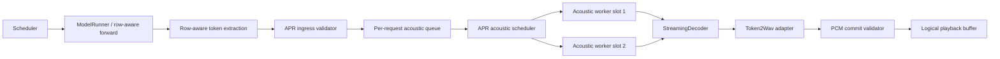

# APR Architecture

## 1. Component Graph



APR is downstream of model execution. It does not participate in physical
model batch formation and has no authority to change RSV/DSV decisions.

## 2. Components

### 2.1 AcousticTokenBatch

The only model-to-APR message:

```python
AcousticTokenBatch(
    request_id: str,
    stream_id: str,
    generation_id: int,
    sequence_no: int,
    stoken_ids: tuple[int, ...],
    source_execution_id: str,
    state_version: int,
    created_monotonic_ns: int,
)
```

The message is immutable after validation. `sequence_no` is monotonic within a
request and `generation_id` changes on interrupt/abort.

### 2.2 AcousticStateStore

The store owns logical state, not workers. Interface:

```python
acquire(request_id, expected_version) -> AcousticLease
commit(lease, next_state, pcm_records) -> CommitResult
cancel(request_id, generation_id) -> CancelResult
release(request_id) -> None
```

An `AcousticLease` contains a request ID, generation ID, state version, and
exclusive lease token. A worker cannot commit with a stale lease.

### 2.3 Per-Request AcousticQueue

Each request has a bounded queue of `AcousticTokenBatch` objects. The initial
capacity is 32 batches per request, selected because it is large enough to
absorb a short model/acoustic phase difference while still making sustained
backpressure visible. Capacity must be recorded in every manifest.

Queue rules:

- enqueue is ordered by `sequence_no`;
- duplicate sequence numbers are rejected;
- gaps are rejected unless the request is explicitly marked interrupted;
- overflow produces `APR_BACKPRESSURE` and pauses only the owning logical
  request's acoustic input;
- tokens are never dropped silently;
- cancellation drains and invalidates queued generations.

### 2.4 APR Scheduler

The scheduler selects a request whose queue is non-empty and whose state lease
is available. The initial policy is strict per-request FIFO with round-robin
selection among ready request IDs. It must not reorder tokens within a request
and must not modify model scheduler selection.

The scheduler records:

```yaml
request_id
worker_slot
sequence_no
queue_depth_before
queue_depth_after
acoustic_scheduling_delay_ns
state_version_before
state_version_after
```

### 2.5 Acoustic Worker

A worker performs exactly one logical transition at a time:

```text
acquire state lease
  -> restore decoder/Token2Wav state
  -> feed one token batch
  -> generate zero or more PCM records
  -> capture next logical state
  -> commit state and PCM atomically
  -> release worker slot
```

The worker must not call model execution, scheduler selection, or request
admission. Worker failure leaves the request in an explicit terminal error
state and releases the worker slot.

## 3. State and Ownership Rules

```text
request_id + generation_id + sequence_no
```

is the ownership key. `state_version` is the commit-order key.

The following are invalid:

- a worker commits a state version lower than the registry version;
- PCM request ID differs from the leased request ID;
- a cancelled generation emits PCM after cancellation;
- one worker holds two request leases simultaneously;
- a request has two committed state versions for the same sequence;
- a queue entry is consumed without a matching state transition.

Each invalid condition is fail-closed and produces a structured APR error.

## 4. Backpressure and Flow Control

APR uses two independent controls:

1. **Ingress backpressure:** the model path sees `queue_depth` and receives an
   explicit `APR_BACKPRESSURE` result when the request queue is full;
2. **Worker scheduling:** the acoustic scheduler chooses among ready queues,
   preventing one request from monopolizing a worker slot.

The initial prototype does not block the vLLM engine while a worker synthesizes
PCM. It also does not discard PCM to conceal overload. If the model-side API
cannot represent bounded backpressure without changing serving semantics, the
prototype stops at the adapter boundary and records the incompatibility.

## 5. Cancellation and Barge-In

Cancellation creates a new generation:

```text
old generation -> cancelled
new generation -> active
```

The scheduler removes old-generation queue entries. A worker that is already
processing the old generation may finish computation, but its output fails the
generation check and is recorded as `PCM_DROPPED_STALE_GENERATION`; it cannot
enter playback. The request's new generation starts with the committed state
defined by the interruption contract.

This preserves the existing Official active-speaking interruption semantics.

## 6. Cleanup

Request cleanup has four explicit barriers:

```text
stop ingress
  -> cancel queued stale generations
  -> wait for active lease to finish or fail
  -> release AcousticStateStore and worker resources
```

Cleanup is successful only when the request registry has no queue entries, no
active lease, no pending PCM commit, and a terminal lifecycle event.

## 7. Failure Model

| Failure | Required behavior |
|---|---|
| Queue overflow | Emit `APR_BACKPRESSURE`; do not drop tokens silently |
| Missing request ID | Reject batch before queue insertion |
| Sequence gap/duplicate | Fail the owning request closed |
| State restore failure | Mark request `APR_STATE_RESTORE_ERROR`; release slot |
| Worker exception | Mark request error; preserve other requests |
| Stale generation | Drop output with explicit stale-generation event |
| PCM validation failure | Reject commit; no playback event |
| Cleanup timeout | `APR_CLEANUP_TIMEOUT`; run is invalid |

## 8. Metrics Contract

APR adds these event types to a versioned diagnostic schema:

```text
APR_TOKEN_ENQUEUED
APR_TOKEN_DEQUEUED
APR_QUEUE_DEPTH
APR_STATE_ACQUIRE
APR_STATE_RESTORE
APR_ACOUSTIC_SCHEDULE
APR_ACOUSTIC_START
APR_ACOUSTIC_END
APR_STATE_COMMIT
APR_PCM_COMMIT
APR_BACKPRESSURE
APR_CANCEL
APR_STALE_OUTPUT
APR_ERROR
```

Required fields:

```yaml
timestamp_monotonic_ns
run_id
request_id
stream_id
generation_id
sequence_no
state_version
worker_slot
queue_depth
```

Derived metrics:

- `token_waiting_time`: dequeue minus enqueue;
- `acoustic_scheduling_delay`: worker start minus ready time;
- `acoustic_processing_time`: worker end minus worker start;
- `pcm_generation_delay`: PCM commit minus token enqueue;
- `queue_depth_mean/p95/max`;
- `state_restore_time` and `state_commit_time`;
- stale-output and backpressure counts.

## 9. Thread-Safety Boundary

The current `_stream_lock` remains unchanged in the APR prototype. APR does not
remove or narrow it. The prototype first measures whether decoupling the
post-extraction acoustic path is sufficient. Any future lock redesign is a
separate serving-runtime proposal requiring its own correctness gate.
